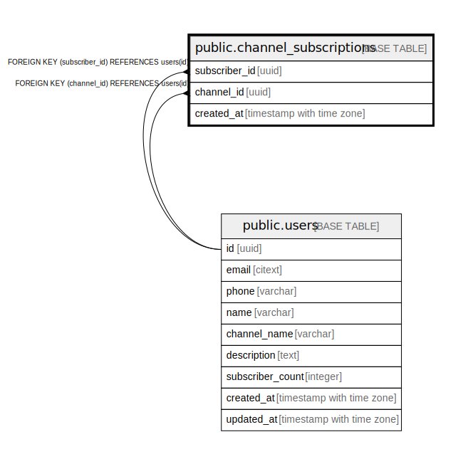

# public.channel_subscriptions

## Description

## Columns

| Name | Type | Default | Nullable | Children | Parents | Comment |
| ---- | ---- | ------- | -------- | -------- | ------- | ------- |
| subscriber_id | uuid |  | false |  | [public.users](public.users.md) |  |
| channel_id | uuid |  | false |  | [public.users](public.users.md) |  |
| created_at | timestamp with time zone | now() | false |  |  |  |

## Constraints

| Name | Type | Definition |
| ---- | ---- | ---------- |
| channel_id_fk | FOREIGN KEY | FOREIGN KEY (channel_id) REFERENCES users(id) |
| subscriber_id_fk | FOREIGN KEY | FOREIGN KEY (subscriber_id) REFERENCES users(id) |
| channel_subscriptions_composite_pk | PRIMARY KEY | PRIMARY KEY (subscriber_id, channel_id) |

## Indexes

| Name | Definition |
| ---- | ---------- |
| channel_subscriptions_composite_pk | CREATE UNIQUE INDEX channel_subscriptions_composite_pk ON public.channel_subscriptions USING btree (subscriber_id, channel_id) |

## Triggers

| Name | Definition |
| ---- | ---------- |
| update_subscriber_count | CREATE TRIGGER update_subscriber_count AFTER INSERT OR DELETE ON public.channel_subscriptions FOR EACH ROW EXECUTE FUNCTION update_subscriber_count() |

## Relations

---

> Generated by [tbls](https://github.com/k1LoW/tbls)
