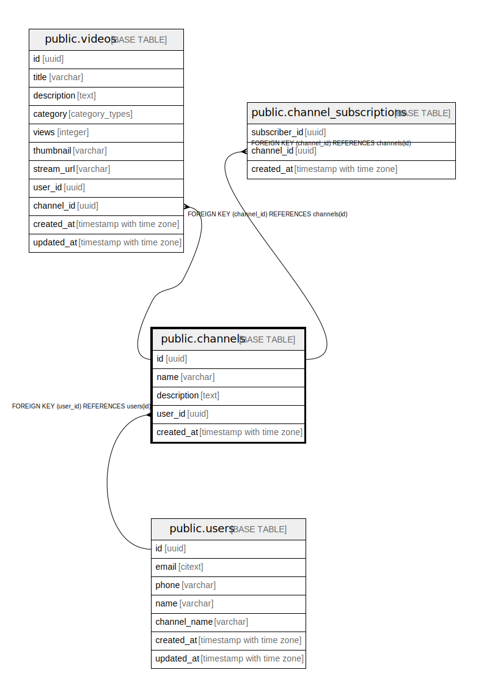

# public.channels

## Description

## Columns

| Name | Type | Default | Nullable | Children | Parents | Comment |
| ---- | ---- | ------- | -------- | -------- | ------- | ------- |
| id | uuid | uuid_generate_v4() | false | [public.videos](public.videos.md) [public.channel_subscriptions](public.channel_subscriptions.md) |  |  |
| name | varchar |  | false |  |  |  |
| description | text |  | true |  |  |  |
| user_id | uuid |  | true |  | [public.users](public.users.md) |  |
| created_at | timestamp with time zone | now() | false |  |  |  |

## Constraints

| Name | Type | Definition |
| ---- | ---- | ---------- |
| users_id_fk | FOREIGN KEY | FOREIGN KEY (user_id) REFERENCES users(id) |
| channels_id_pk | PRIMARY KEY | PRIMARY KEY (id) |
| channels_name_key | UNIQUE | UNIQUE (name) |

## Indexes

| Name | Definition |
| ---- | ---------- |
| channels_id_pk | CREATE UNIQUE INDEX channels_id_pk ON public.channels USING btree (id) |
| channels_name_key | CREATE UNIQUE INDEX channels_name_key ON public.channels USING btree (name) |

## Relations

---

> Generated by [tbls](https://github.com/k1LoW/tbls)
