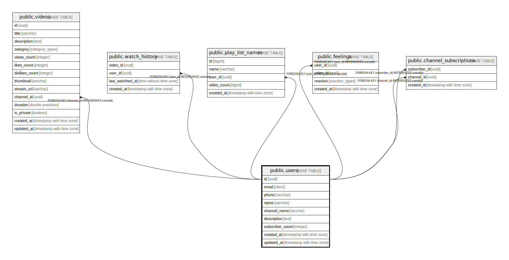

# public.users

## Description

## Columns

| Name | Type | Default | Nullable | Children | Parents | Comment |
| ---- | ---- | ------- | -------- | -------- | ------- | ------- |
| id | uuid | uuid_generate_v4() | false | [public.channels](public.channels.md) [public.videos](public.videos.md) [public.play_list_names](public.play_list_names.md) [public.feelings](public.feelings.md) [public.channel_subscriptions](public.channel_subscriptions.md) |  |  |
| email | citext |  | false |  |  |  |
| phone | varchar |  | true |  |  |  |
| name | varchar |  | false |  |  |  |
| channel_name | varchar |  | true |  |  |  |
| created_at | timestamp with time zone | now() | false |  |  |  |
| updated_at | timestamp with time zone |  | true |  |  |  |

## Constraints

| Name | Type | Definition |
| ---- | ---- | ---------- |
| users_id_pk | PRIMARY KEY | PRIMARY KEY (id) |
| users_email_key | UNIQUE | UNIQUE (email) |

## Indexes

| Name | Definition |
| ---- | ---------- |
| users_id_pk | CREATE UNIQUE INDEX users_id_pk ON public.users USING btree (id) |
| users_email_key | CREATE UNIQUE INDEX users_email_key ON public.users USING btree (email) |

## Triggers

| Name | Definition |
| ---- | ---------- |
| set_updated_at | CREATE TRIGGER set_updated_at BEFORE UPDATE ON public.users FOR EACH ROW EXECUTE FUNCTION update_at_timestamp() |

## Relations

---

> Generated by [tbls](https://github.com/k1LoW/tbls)
