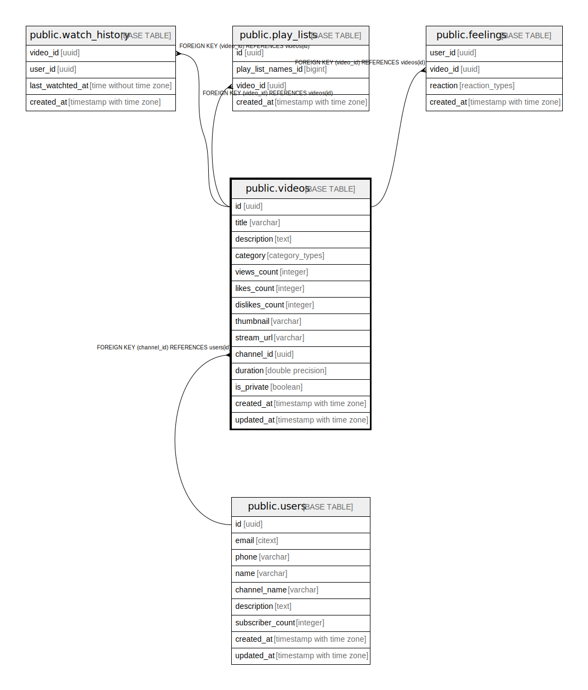

# public.videos

## Description

## Columns

| Name | Type | Default | Nullable | Children | Parents | Comment |
| ---- | ---- | ------- | -------- | -------- | ------- | ------- |
| id | uuid | gen_random_uuid() | false | [public.watch_history](public.watch_history.md) [public.play_lists](public.play_lists.md) [public.feelings](public.feelings.md) |  |  |
| title | varchar |  | false |  |  |  |
| description | text |  | true |  |  |  |
| category | category_types | 'UNCATEGORISED'::category_types | true |  |  |  |
| views_count | integer | 0 | true |  |  |  |
| likes_count | integer | 0 | true |  |  |  |
| dislikes_count | integer | 0 | true |  |  |  |
| thumbnail | varchar |  | false |  |  |  |
| stream_url | varchar |  | false |  |  |  |
| channel_id | uuid |  | false |  | [public.users](public.users.md) |  |
| duration | double precision |  | true |  |  |  |
| is_private | boolean | false | true |  |  |  |
| created_at | timestamp with time zone | now() | false |  |  |  |
| updated_at | timestamp with time zone |  | true |  |  |  |

## Constraints

| Name | Type | Definition |
| ---- | ---- | ---------- |
| dislikes_nonnegative | CHECK | CHECK ((dislikes_count >= 0)) |
| duration_nonnegative | CHECK | CHECK ((duration > (0)::double precision)) |
| likes_nonnegative | CHECK | CHECK ((likes_count >= 0)) |
| title_length | CHECK | CHECK ((char_length((title)::text) <= 100)) |
| views_nonnegative | CHECK | CHECK ((views_count >= 0)) |
| channels_id_fk | FOREIGN KEY | FOREIGN KEY (channel_id) REFERENCES users(id) |
| videos_id_pk | PRIMARY KEY | PRIMARY KEY (id) |
| videos_thumbnail_key | UNIQUE | UNIQUE (thumbnail) |
| videos_stream_url_key | UNIQUE | UNIQUE (stream_url) |

## Indexes

| Name | Definition |
| ---- | ---------- |
| videos_id_pk | CREATE UNIQUE INDEX videos_id_pk ON public.videos USING btree (id) |
| videos_thumbnail_key | CREATE UNIQUE INDEX videos_thumbnail_key ON public.videos USING btree (thumbnail) |
| videos_stream_url_key | CREATE UNIQUE INDEX videos_stream_url_key ON public.videos USING btree (stream_url) |
| videos_channel_id_idx | CREATE INDEX videos_channel_id_idx ON public.videos USING btree (channel_id) |

## Triggers

| Name | Definition |
| ---- | ---------- |
| set_updated_at | CREATE TRIGGER set_updated_at BEFORE UPDATE ON public.videos FOR EACH ROW EXECUTE FUNCTION update_at_timestamp() |

## Relations

---

> Generated by [tbls](https://github.com/k1LoW/tbls)
