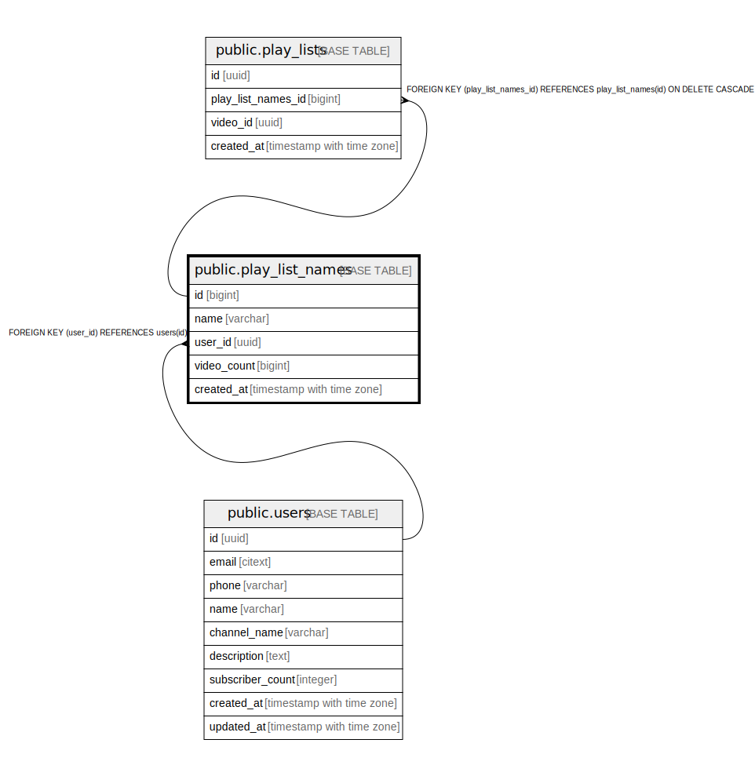

# public.play_list_names

## Description

## Columns

| Name | Type | Default | Nullable | Children | Parents | Comment |
| ---- | ---- | ------- | -------- | -------- | ------- | ------- |
| id | bigint |  | false | [public.play_lists](public.play_lists.md) |  |  |
| name | varchar |  | false |  |  |  |
| user_id | uuid |  | false |  | [public.users](public.users.md) |  |
| video_count | bigint | 0 | true |  |  |  |
| created_at | timestamp with time zone | now() | false |  |  |  |

## Constraints

| Name | Type | Definition |
| ---- | ---- | ---------- |
| users_id_fk | FOREIGN KEY | FOREIGN KEY (user_id) REFERENCES users(id) |
| play_list_names_id_pk | PRIMARY KEY | PRIMARY KEY (id) |

## Indexes

| Name | Definition |
| ---- | ---------- |
| play_list_names_id_pk | CREATE UNIQUE INDEX play_list_names_id_pk ON public.play_list_names USING btree (id) |

## Relations

---

> Generated by [tbls](https://github.com/k1LoW/tbls)
