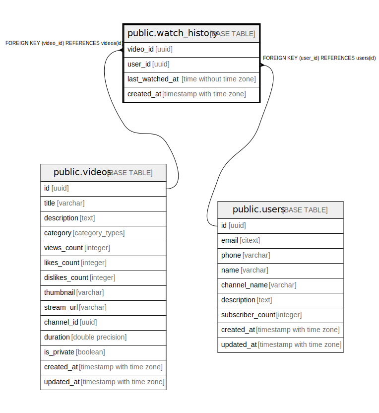

# public.watch_history

## Description

## Columns

| Name | Type | Default | Nullable | Children | Parents | Comment |
| ---- | ---- | ------- | -------- | -------- | ------- | ------- |
| video_id | uuid |  | false |  | [public.videos](public.videos.md) |  |
| user_id | uuid |  | false |  | [public.users](public.users.md) |  |
| last_watched_at | time without time zone |  | true |  |  |  |
| created_at | timestamp with time zone | now() | false |  |  |  |

## Constraints

| Name | Type | Definition |
| ---- | ---- | ---------- |
| users_id_fk | FOREIGN KEY | FOREIGN KEY (user_id) REFERENCES users(id) |
| videos_id_fk | FOREIGN KEY | FOREIGN KEY (video_id) REFERENCES videos(id) |
| watch_history_cs_pk | PRIMARY KEY | PRIMARY KEY (video_id, user_id) |

## Indexes

| Name | Definition |
| ---- | ---------- |
| watch_history_cs_pk | CREATE UNIQUE INDEX watch_history_cs_pk ON public.watch_history USING btree (video_id, user_id) |

## Relations

---

> Generated by [tbls](https://github.com/k1LoW/tbls)
